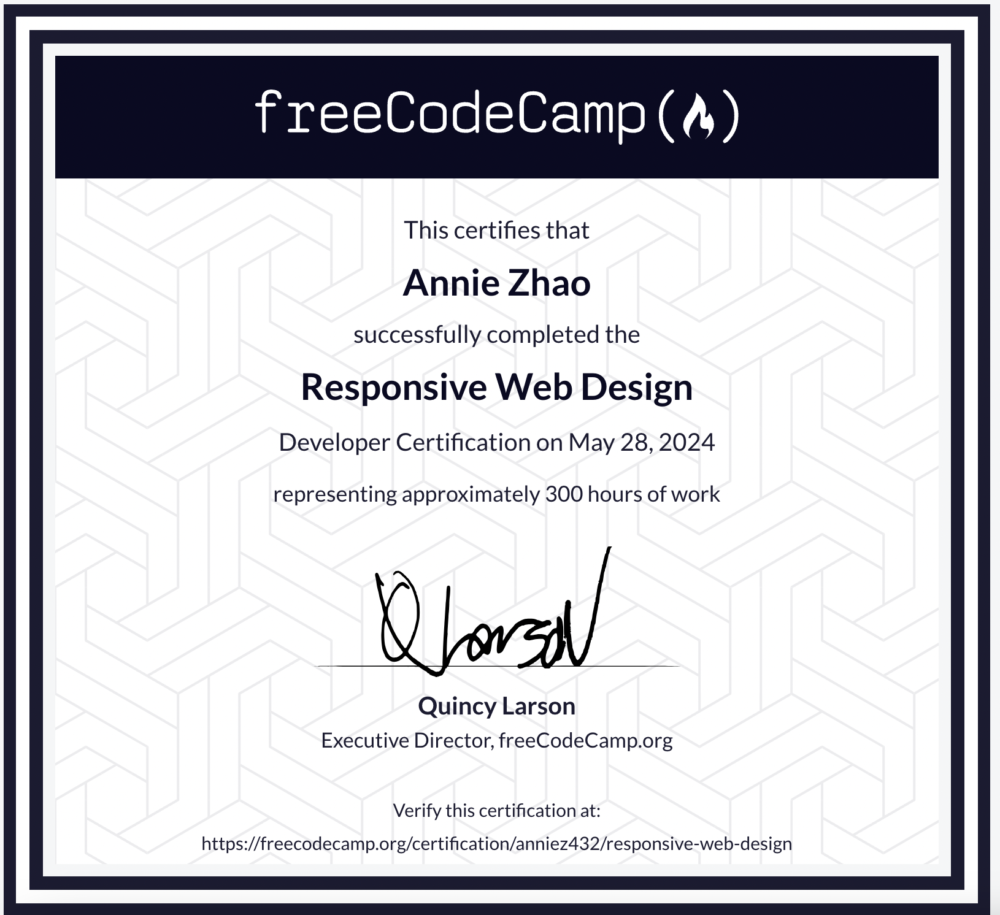

# Responsive Web Design Course Projects

_Projects I completed to earn my Responsive Web Design Course Certification from freeCodeCamp._

**Certificate:**

</img>

**Overview of projects:**
_Survey Form_: A generic survey that could be used after an event - the first project I created.

_Discrete Math Review Page_: A technical documentation page project I created as a review page for my Discrete Mathematics class.

_Personal Portfolio_: A webpage showcasing my professional/educational experience that served as my final project.

